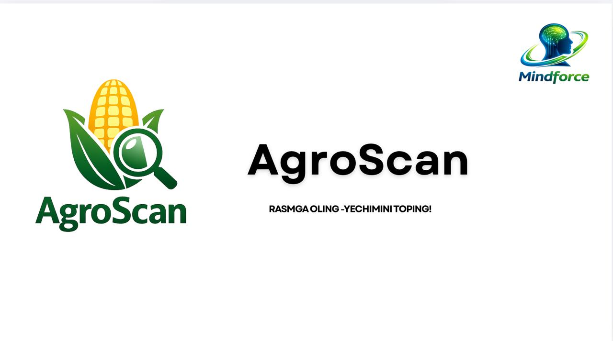

<div align="center">
  
</div>

# 🌱 AgroScan – Smart Farming Assistant

AgroScan — bu dehqonlar va tomorqa egalari uchun yaratilgan zamonaviy AI yordamchi platforma bo‘lib, ekinlarni tahlil qilish, hosilni rejalashtirish va daromadni hisoblash imkonini beradi. Ilova web va Telegram Web App (Mini App) sifatida ishlaydi.

---

## 🚀 Asosiy imkoniyatlar

### 🤖 AI Diagnostika

* Rasm yuklash orqali o‘simlikni aniqlash
* Kasallik diagnostikasi
* Ishonch darajasi (%)
* Sababi va davolash bo‘yicha tavsiyalar

### 🌾 Mening Tomorqam

Foydalanuvchi o‘z tomorqasini tizimga bir marta kiritadi, va AgroScan uni doimiy ravishda kuzatib boradi.

🔍 Nimalar nazorat qilinadi?
🌱 Ekin turi (pomidor, bodring va boshqalar)
📍 Joylashuv (hudud va iqlim)
🌦 Ob-havo sharoiti
💧 Tuproq namligi (sensor yoki AI orqali baholash)
📸 O‘simlik holati (rasmlar orqali)

### 📊 Daromad Kalkulyatori

* Profil sahifasida: istalgan ekin uchun hisoblash
* Tomorqa sahifasida: faqat ekilgan ekinlar asosida avtomatik hisob
* Xarajatlar:

  * Urug‘
  * O‘g‘it
  * Suv
  * Ishchi kuchi va boshqalar
* Sof foyda hisoblash
* 📄 PDF hisobot yuklab olish

### 🛒 Bozor (Market Insights)

* Hududga mos TOP ekinlar
* Talab darajasi (High / Medium / Low)
* Narx trendi
* Hosildorlik va daromad
* “Tezkor qo‘shish” orqali ekin yaratish

## 🌐 API Integratsiya


## 📍 Geolokatsiya

* Register paytida avtomatik aniqlanadi
* Qishloq / tuman / viloyat darajasida
* Ob-havo va bozor ma’lumotlari uchun ishlatiladi

---

## 📱 Telegram Web App

```
@agroscan_v1_bot
https://hackathon-front-7t48.onrender.com/
```

---

## 🎨 UI/UX

* To‘liq responsive (mobile-first)
* Sidebar mobil versiyada faqat ikonlar
* Clean va minimal dizayn
* Kichik ekranlar uchun optimallashtirilgan shriftlar

---

## ⚡ Performance

* Duplicate request oldini olish (throttling)
* Local state sync (refreshsiz update)
* Empty state handling (500 error ko‘rsatmaydi)

---

## 🛠 Texnologiyalar

* React + TypeScript
* TailwindCSS
* Axios
* OpenAI (gpt-4o-mini)
* OpenWeather API
* Telegram Web App SDK
* Nest js
* Postgress SQL
* Prisma


## 💡 Kelajak rejalar

* Real marketplace (sotish tizimi)
* Push notification (hosil va ob-havo)
* AI asosida ekin tavsiya engine
* Offline rejim

---

## 👨‍🌾 Maqsad

AgroScan — bu oddiy ilova emas. Bu dehqonlar uchun:

* qaror qabul qilish vositasi
* daromadni oshirish platformasi
* AI yordamchi

---

**AgroScan bilan aqlli dehqonchilikni boshlang 🚜**
